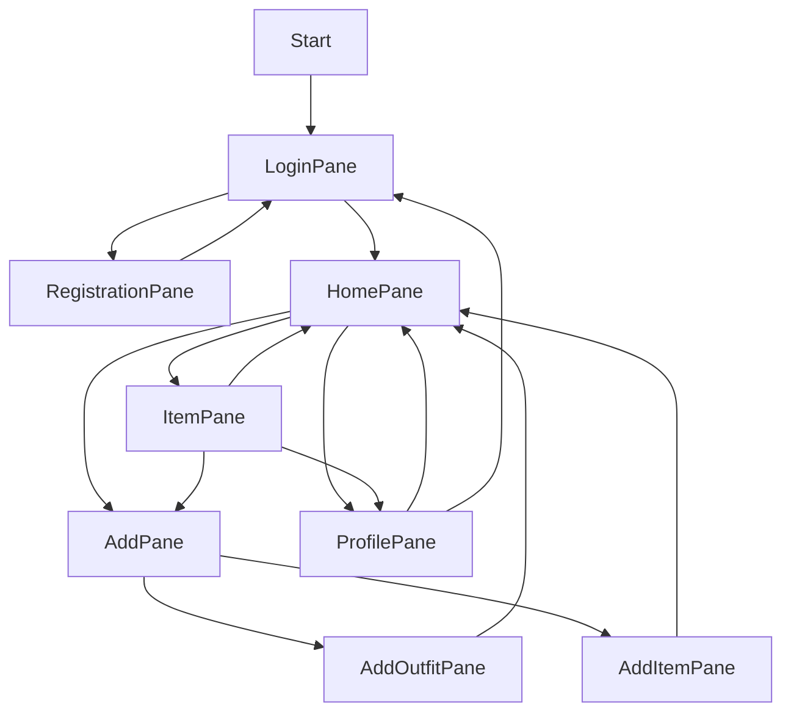
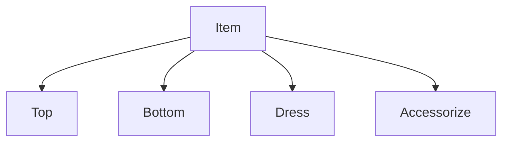
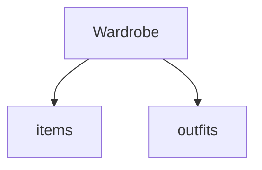
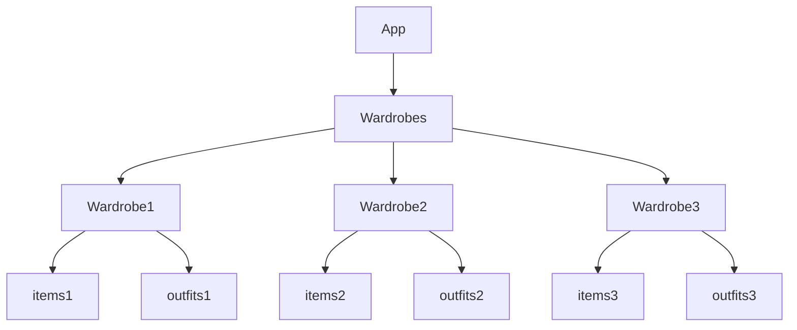

# My Wardrobe - Organize your wardrobe

## 1. About

Our project aimed to develop a mobile application that creates a digital version of users' closets, providing them with a convenient way to access their wardrobe anytime, anywhere. The primary goal was to address the common problem many people face every morning, standing in front of their closet, when they exclaim, "I have nothing to wear!" The app assists users in organizing their clothing items effectively.

The top menu bar facilitates easy navigation throughout the app, while the search filters enable users to quickly locate specific clothing items they are looking for.

### 1.1. Demo

Project presentation: https://youtu.be/JO-LADywFp4

## 2. Authors

This project was created by:

* Avezzù Irene
* Sacchetto Joséphine

## 3. Usage

To run our application is required Java 17, since it's a maven project there is no need to have JavaFX installed as long as the project is run with the following commands.

To build the project, run:

```shell
mvn package
```

To run the main class, run:

```
mvn clean javafx:run
```

Another option to run the project is to open it with IntelliJ IDEA and directly run the Start class. If the error "JavaFX runtime components are missing, and are required to run this application" is generated a new VM Option must be set as shown in this video (https://www.youtube.com/watch?v=hS_6ek9rTco).

Once the application is running the user can either create a new account or use one of the existing ones:
- User1: username: username1 - psw: password1!
- User2: username: josephine - psw: jose1!
- User3: username: irene - psw: irene3!

## 4. Implementation

### 4.1. Architectural Overview

We divided our idea into blocks structuring our application in classes.

FRONT-END:
The Start class represents the starting point for our application, it creates an item of LoginPane which, based on the user actions, can lead to a RegisterPane (where the user can create a new account and then be redirected to the LoginPane) or the HomePane. The HomePane allows the user to filter the items (ItemPane), add new items/outfits (AddPane, AddOutfitPane, AddItemPane), or go to its Profile (ProfilePane).



BACK-END:
The Item class represents the base element for the wardrobe. Top, Bottom, Dress, and Accessorize classes extend it.

The Wardrobe class simulates a user's wardrobe which contains a collection of items and outfits.

The App class is a collection of wardrobes, it provides methods that support the connection to the GUI.


### 4.2. Libraries

We used many libraries to develop our application:

  For I/O:
  - java.io.*
  - java.util.Scanner
  - com.google.gson.Gson

  For the GUI:
  - javafx.*

  For creating arrays and input:
  - java.util.ArrayList


### 4.3. Programming Techniques

List and explain how you used the 10 programming techniques required for this project.
1.   **GUI:** We used JavaFX to realize the GUI;
2.   **Logging:** each user has its wardrobe so creating an account was a necessity and to allow more users on the same devices logging become fundamental;
3.   **I/O file:** we used a file to obviate the absence of a database, we used external text files to "remember" the past uses of the application. Files are also used to import items in a faster way compared to the manual option. In addition, input files are used to assign to each item and outfit a picture;
4.   **Try/catch:** try and catch were necessary when working with I/O file;
5.   **Overriding:** the toString of the class Item and Outfit has been overridden;
6.   **Overloading:** we used multiple constructors for the Item obj based on which parameters were passed;
7.   **Serialization:** we used serialization to simulate a database, the application is saved in a JSON file and reloaded every time the app is open;
8.   **Deserialization:** we used deserialization to allow our application to create items objects from a JSON file and to load the application from its JSON file used to simulate a database;
9.   **Varargs:** we used Varargs in the Wardrobe class in its search method because in some cases we pass only one parameter to filter but in other cases, we pass multiples string;
10.  **Custom exceptions:** we used custom exceptions to handle problems in the loginPane, registerPane, addItemPane, and addOutifitPane;
11.  **Regular expression:** we used regular expressions to recognize if the email and phone numbers were in the correct format.

### 4.4. Tests

To assert all actions of our application work in the correct way we worked on both white-box testing and black-box testing. To make sure the application worked we asked the help of some of our friends (both computer science experts and non-experts) to develop the black-box testing suites to test it and based on their feedback we fixed the portions of the code that were not functioning correctly. The GUI was tested both by us and other people to make sure a complete test suit was created.

## 5. Experience

### 5.1. Overall Experience

The idea for this project came to us pretty easily but the realization did not come as easy. We wanted to create something that could be useful. We initially struggled with the impossibility of using a database. The choice between a web app and a desktop app took us some time but in the end, we choose a desktop app because it would be easier to upload a picture of items for the users.

Despite not having prior experience working together on a project, we efficiently allocated the necessary implementations for the app. However, we did not effectively manage the given time initially. Nonetheless, we ultimately succeeded in completing the assigned task.

### 5.2. Division of Responsibilities

Description of the roles and responsibilities that each member had in this project:

- **Irene Avezzù:** I was mainly responsible for the implementation of the backend of the app
- **Josephine Sacchetto:** I was mainly responsible for the implementation of the front end of the app
- We worked separately on the actual realization of the code but the idea for both the structure of the backend and the illustrations of the front end were discussed and outlined together. We developed together the connection between the front and backend. We also worked together when extra materials were needed, such as images or research on structure (e.g. object of JavaFx). We collaborated on the realization of the test suits.

### 5.3. Main Challenges

Elaborate on the main challenges each group member faced throughout the project and how they were surpassed.

- **Irene Avezzù:** The most difficult aspect of this project for me was to implement the test suits because I still struggle in the creation of a complete suit for testing. In addition, working with Maven was difficult, especially in the realization of the POM file.
- **Josephine Sacchetto:** The most difficult thing for me was the organization of time. The reason was that I had no clear plan to follow so I had to stop and create a detailed plan with day/week/month goals to work toward. By doing this I was able to work better.

### 5.4. Learning Outcomes

Describe what you learned with this project.

- **Irene Avezzù** I gained experience with Gson while working on serialization and deserialization methods. Additionally, I discovered that connecting the backend and frontend components of the app required more time than initially anticipated. Furthermore, during this group project, I also learned how important it is to set coding style rules before beginning to have consistent code.
- **Josephine Sacchetto:** I learned how to implement the design pattern and that without communication among those working on the same project, one cannot proceed effectively and efficiently toward the result.


### Clarification

The project was initially developed as explained so far by the two students but after the winter semester of the academic year 2022-23, Josephine withdrew from her studies. During the first exam session, in which I presented the whole project, some issues with code readability and transportability on different operating systems occurred. I was the only one who worked on the project since then to resolve these problems. I take responsibility only for the code readability of the front end but the rest of it was Josephine's work.
